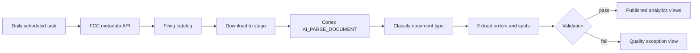

# FCC Public Files → Structured Data with Snowflake Cortex

> Personal project built entirely on FCC public inspection files, which are public records. Unlike the sanitized case studies in this portfolio, nothing here is derived from employer systems: the data source, the documents, and the SQL are all public by construction.

## Problem

Every US broadcast television station must maintain a public inspection file with the FCC, including its political advertising orders. The archive holds advertiser names, flight dates, program placements, and per-spot rates — genuinely useful public-records data that is effectively unreadable at scale because it lives in scanned PDFs.

The engineering problem is not "read a PDF." It is that a single station's file mixes at least three document types with different semantics, the documents are scans and faxes rather than clean digital forms, and a rate table parsed incorrectly produces confidently wrong dollar figures. Getting a number out is easy; knowing whether to trust it is the work.

## Data Basis

FCC public inspection files, retrieved through the FCC's official public metadata API and file host — both unauthenticated, both intended for programmatic access. The pipeline uses only those official endpoints. The FCC's web UI sits behind bot protection, and the correct response is to use the published API rather than to defeat the protection.

Three document types drive the design:

| Document type | Carries rates? | Extraction implication |
|---|---|---|
| Agreement form | No, by design | A missing rate is expected, not a defect |
| Media order | Yes, multi-page rate tables | The richest and hardest target |
| Invoice | Yes, what actually aired | Reconciles against the order |

Classification therefore has to happen before extraction, or the quality metrics are meaningless.

## Architecture

Everything runs inside one Snowflake database across three schemas — `RAW` for staged PDFs and the download log, `PARSED` for Cortex layout output and classification, `ANALYTICS` for extracted orders, spot line items, and the exception view. There is no infrastructure outside Snowflake: no external orchestrator, no separate OCR service, no application tier.

## Engineering Decisions

| Decision | Reason | Tradeoff |
|---|---|---|
| Use the official metadata API, never the web UI | The published endpoints serve the same documents over plain HTTP | Coverage is bounded by what the API exposes |
| Restrict outbound access to FCC hostnames | An external access integration should not be a general-purpose internet door | Requires `ACCOUNTADMIN` once, at setup |
| Log every download with status, size, and SHA-256 | Makes re-runs idempotent and gaps visible | Storage overhead for the log |
| Parse in `LAYOUT` mode | Rate tables are meaningless without preserved table structure | More verbose output than plain text mode |
| Classify before extracting | A missing rate means different things on different document types | An extra Cortex call per document |
| Quarantine failing rows instead of dropping or publishing them | Dirty data must never masquerade as clean data | Published views under-report until exceptions are worked |
| Let a failed task step log without blocking later steps | One bad document should not halt the nightly cycle | Partial-completion states need monitoring |

## Public-Safe Pattern

The [SQL](sql/) is numbered in execution order and runs against public data as written:

| File | Role |
|---|---|
| [`01_setup.sql`](sql/01_setup.sql) | Database, schemas, right-sized warehouse, hostname-restricted external access |
| [`02_catalog.sql`](sql/02_catalog.sql) | Enumerate filings per station and cycle from the public API |
| [`03_download.sql`](sql/03_download.sql) | Idempotent, checksummed retrieval into an internal stage |
| [`04_parse.sql`](sql/04_parse.sql) | `AI_PARSE_DOCUMENT` in `LAYOUT` mode; unparseable files recorded, not dropped |
| [`05_extract.sql`](sql/05_extract.sql) | Classification, then order-level and spot-level extraction |
| [`06_quality.sql`](sql/06_quality.sql) | Named exception reasons; failing rows held out of published views |
| [`07_schedule.sql`](sql/07_schedule.sql) | Daily task chain with per-step outcome logging |

## Accuracy and Cost

Both are reported as measured figures from a given corpus, not asserted here.

Accuracy is scored against a hand-annotated ground truth: sample 30–50 documents stratified across the three document types, annotate the target fields, then score field-level extraction — exact match for rates and dates, normalized match for names — and publish the confusion cases alongside the headline number.

Cortex document parsing is priced per page, so cost scales with corpus size and nothing else. The pipeline records per-document credit consumption, which makes cost-per-document a measured output of a run rather than an estimate.

## Runbook

1. Confirm the catalog step found the expected filings for the station and cycle.
2. Check the download log for non-200 statuses and byte-size anomalies before parsing.
3. Verify page counts on parse output; a one-page result for a known multi-page order is a red flag.
4. Review the classification distribution — an implausible split usually means layout extraction degraded.
5. Query the exception view by reason before trusting any published totals.
6. Work exceptions by category rather than row by row; most cluster into a few root causes.
7. Re-run only the affected step; downloads are idempotent and parses are keyed by file.

## Failure Modes

- multi-page rate schedules split across page breaks and lose row context;
- two-digit years OCR into the wrong century, producing plausible but wrong flight dates;
- multi-tier rate cards carry ambiguous semantics that no single extraction rule resolves;
- agreement forms are scored as extraction failures when they carry no rates by design;
- arithmetic that does not reconcile is published because nothing checks it;
- a nightly run partially completes and the gap is invisible without per-step logging.

## What I Would Improve Next

Page-break-aware table stitching, an explicit century-resolution rule tied to the filing cycle, per-document-type accuracy targets rather than one blended number, reconciliation of invoices against their originating orders, alerting on exception-rate drift, and a broader annotated corpus to make the accuracy figure statistically meaningful.

## Note on Scope

The data is public records, retrieved through official public endpoints. No access control is circumvented anywhere in this pipeline. This is a personal engineering project; the views and code are my own and not those of any employer, and no employer system, document, identifier, or figure appears in it.
