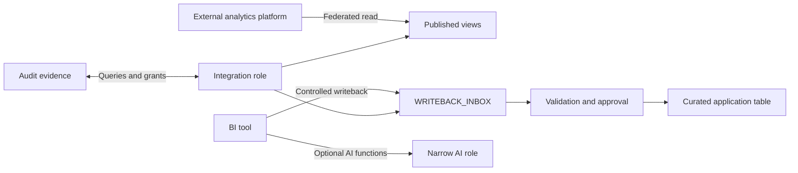

# Governed BI Integrations

> Sanitized case study based on recent federation, BI writeback, role, grant, tagging, and AI-enablement work.

## Problem

Analytics integrations often begin as a connectivity request but quickly acquire write access, service identities, AI capabilities, and cross-platform data paths. The engineering goal was to make those boundaries explicit so each integration could do its job without becoming a general-purpose path around governance.

## Architecture

## What the Recent Work Demonstrates

- testing and granting access for a cross-platform federation path;
- establishing tables and privileges for controlled BI writeback;
- separating integration identities from human roles;
- attaching governance metadata to integration objects;
- enabling AI-related capabilities through an explicit access boundary.

## Engineering Decisions

| Decision | Reason | Tradeoff |
|---|---|---|
| Publish views instead of source tables | Stabilizes the consumer contract | Adds another layer to own and test |
| Write into an inbox, not the curated table | Creates a validation and audit boundary | Writeback is not immediately visible downstream |
| Use a dedicated integration role | Limits blast radius and improves evidence | More roles and grants to maintain |
| Separate AI capability from ordinary read access | Keeps optional features from broadening every user | Capability checks become part of onboarding |

## Public-Safe Pattern

The [writeback boundary](sql/01_governed_writeback.sql) uses synthetic fields and shows validation, deduplication, and promotion as separate stages.

## Runbook

1. Confirm the integration identity, owner, source network, and required operations.
2. Test read and write paths separately with least-privilege roles.
3. Validate payload shape, allowed values, duplicate request IDs, and actor attribution.
4. Quarantine rejected rows with a reason; do not silently discard them.
5. Promote accepted rows through a controlled procedure or task.
6. Review query history, grants, and stale integration users on a schedule.

## Failure Modes

- a service role inherits unrelated privileges;
- writeback bypasses validation or overwrites curated history;
- federated queries create unpredictable cost or performance;
- an external identity loses ownership and remains active;
- AI permissions are bundled with broader platform capabilities than required.

## What I Would Improve Next

Add request signing, row-access tests, workload isolation, per-integration budgets, schema contracts, replay protection, automated identity expiration, and end-to-end negative-access tests.

## Sanitization Note

No vendor, platform, account, endpoint, role, user, table, payload, or business workflow from the private environment is included.

