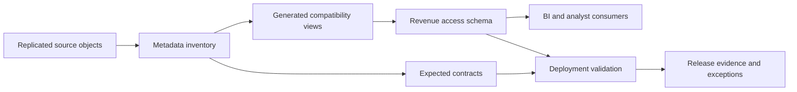

# Revenue Analytics Access Layer

> Sanitized case study based on recent Snowflake work. All identifiers, scale references, and SQL are public-safe replacements.

## Problem

A replicated operational revenue domain exposed a broad set of source objects, but analytics consumers needed a stable, discoverable access layer. The engineering challenge was not a single complex transformation; it was deploying and validating a large projection-oriented view surface without losing control of schema drift, ownership, or access.

## Evidence Basis

Read-only query-history analysis showed a concentrated deployment window dominated by view DDL, supported by a smaller set of tables, validation queries, and administrative calls. The views were overwhelmingly direct projections rather than join-heavy models. This case study therefore focuses on metadata-driven publishing and contract controls—not on claiming complex metric modeling that the evidence does not show.

## Architecture

## Engineering Decisions

| Decision | Reason | Tradeoff |
|---|---|---|
| Generate repetitive DDL from metadata | Makes a broad surface consistent and reviewable | A generator defect can affect many objects quickly |
| Use projection views for compatibility | Minimizes transformation logic in the access layer | `SELECT *` can propagate unexpected source changes |
| Separate contracts from deployment | Detects missing or changed objects before consumers do | Contract metadata requires ownership and upkeep |
| Validate the complete surface after release | Finds partial deployments and column drift | Validation adds release time and evidence storage |

## Public-Safe Pattern

The companion [contract check](sql/01_validate_view_contracts.sql) compares an expected inventory with Snowflake metadata. It deliberately avoids private DDL and business fields.

## Runbook

1. Freeze the deployment manifest and record its version.
2. Confirm every expected source object exists and is accessible to the deployment role.
3. Generate DDL into a reviewable artifact; do not execute directly from unreviewed metadata.
4. Deploy in bounded batches and stop on unexpected failures.
5. Compare expected and actual views, column counts, ownership, and grants.
6. Publish release evidence and route exceptions to an owner.

## Failure Modes

- source columns change after a compatibility view is published;
- generated DDL succeeds partially and leaves an incomplete surface;
- ownership or future grants differ between batches;
- consumers mistake a compatibility layer for a governed semantic model;
- a broad projection exposes fields that should have been excluded.

## What I Would Improve Next

Replace unrestricted projections with explicit generated column lists, classify fields before publication, add contract tests to CI, version the manifest, and separate compatibility views from curated business metrics.

## Sanitization Note

No source-system name, object name, column, metric, deployment count, timestamp, query text, or consumer identity is included.

