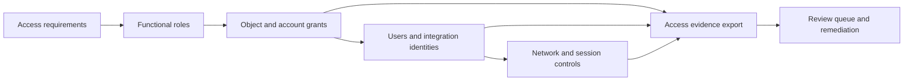

# Snowflake Platform Governance

> Sanitized case study based on recent roles, grants, user administration, network controls, and access-evidence work.

## Problem

Platform access had to support multiple tools and teams while remaining reviewable. Treating each grant or user change as an isolated ticket would make the final state difficult to explain, so the work is framed as a governance lifecycle: design, apply, export evidence, detect drift, and remediate.

## Architecture

## What the Recent Work Demonstrates

- creating and refining functional roles;
- applying and reviewing grants at material scale;
- administering user and integration access;
- establishing network-policy boundaries;
- creating tables and automation for repeatable RBAC evidence.

## Engineering Decisions

| Decision | Reason | Tradeoff |
|---|---|---|
| Grant privileges to functional roles, not individuals | Makes access explainable and removable | Role hierarchy needs disciplined ownership |
| Export access evidence on a schedule | Supports review and drift detection | Snapshots need retention and secure storage |
| Separate network controls from data privileges | Both layers matter and fail differently | Troubleshooting must inspect multiple control planes |
| Review broad grants as explicit exceptions | Prevents convenience access becoming permanent | Exception handling adds process overhead |

## Public-Safe Pattern

The [access evidence query](sql/01_access_evidence.sql) creates a review-oriented result without embedding any private role or object name.

## Runbook

1. Identify the identity, functional role, requested capability, and owner.
2. Confirm the narrowest existing role cannot satisfy the requirement.
3. Review object grants and account-level privileges separately.
4. Apply the change through the approved deployment path.
5. Export post-change evidence and compare it with the intended state.
6. Test both allowed and denied behavior.
7. Assign an expiration or recurring review to exceptions.

## Failure Modes

- direct user grants bypass the role model;
- inherited privileges make a role broader than its name suggests;
- a network policy blocks a valid integration or permits an unintended source;
- evidence captures grants but not effective access through hierarchy;
- temporary administrative access is never removed.

## What I Would Improve Next

Add policy-as-code checks, an approved role catalog, effective-access graph analysis, exception expirations, automated owner attestations, and deployment tests for both positive and negative access cases.

## Sanitization Note

No organization, user, role, policy, address, integration, grant target, or audit record from the private environment is included.

