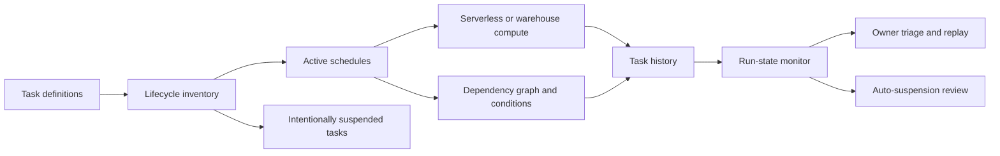

# Task Orchestration Operations

> Sanitized case study based on recent Snowflake task definitions and execution-state metadata. No task name, schedule, definition, count, or business domain is reproduced.

## Problem

A task estate becomes an operational product once it grows beyond a few schedules. Teams need to know which tasks are intentionally active, which are suspended, how dependencies behave, why runs are skipped, when failures trigger auto-suspension, and who owns recovery.

## Evidence Basis

Read-only metadata showed a large recently created task estate with a smaller active subset. It included both serverless and warehouse-backed tasks, limited dependency graphs and conditions, and real histories of successful, skipped, failed, and auto-suspended runs. Error-routing integrations were not consistently present, making observability and lifecycle governance the honest center of this case study.

## Architecture

## Engineering Decisions

| Decision | Reason | Tradeoff |
|---|---|---|
| Treat suspended tasks as governed inventory | Distinguishes intentional retirement from silent abandonment | Requires an owner and disposition for every task |
| Monitor run outcomes separately | Success, skip, failure, and auto-suspension mean different things | More nuanced alert rules are required |
| Record graph relationships | Prevents child failures from being investigated in isolation | Task graphs are harder to replay safely |
| Separate serverless and warehouse-backed policy | Cost, sizing, and failure modes differ | Operations must support two compute models |
| Add explicit error routing | Reduces dependence on manual history review | Notification noise needs tuning |

## Public-Safe Pattern

The [task-fleet monitor](sql/01_task_fleet_monitor.sql) summarizes lifecycle and recent run states without exposing task definitions or query text.

## Runbook

1. Confirm whether the task is active, intentionally suspended, or auto-suspended.
2. Inspect the most recent run state and the upstream graph before replaying anything.
3. Classify skipped runs as expected condition behavior or an upstream-data problem.
4. For failures, capture the error category privately and identify affected downstream tasks.
5. Correct the root cause and execute one bounded replay in dependency order.
6. Verify target state, resume the schedule when appropriate, and monitor the next run.
7. Retire obsolete task definitions instead of leaving indefinite suspended inventory.

## Failure Modes

- large suspended inventories hide which tasks still matter;
- skipped runs are treated as harmless without checking the condition or predecessor;
- a child task is replayed before its upstream state is repaired;
- auto-suspension stops recurring damage but no owner notices;
- warehouse-backed tasks contend with unrelated workloads;
- serverless tasks run successfully but without explicit cost ownership.

## What I Would Improve Next

Add mandatory task ownership and purpose tags, error and success integrations, expected-run windows, graph-aware replay tooling, stale-suspension cleanup, workload-specific cost reporting, and SLO dashboards based on run outcomes rather than task existence.

## Sanitization Note

No task name, definition, graph, schedule, owner, warehouse, error, fleet size, run count, timestamp, or business outcome is included.

