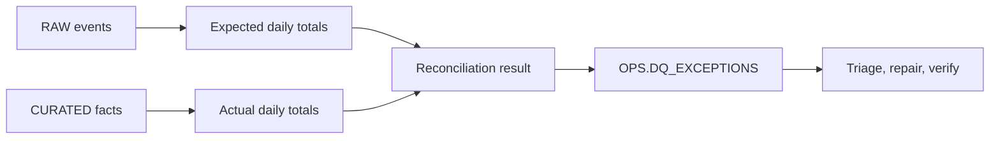

# Data Quality Reconciliation

> Portfolio lab using synthetic order data and example controls.

## Purpose

Detect whether records and amounts remain consistent as data moves from a raw event layer into a curated analytical table, then route exceptions into an explicit response process.

## Architecture

## Checks Included

- source-versus-target record count;
- source-versus-target amount total;
- freshness of the latest curated record;
- duplicate business keys;
- durable exception status and owner fields.

## Quick Start

1. Review [sql/01_reconciliation.sql](sql/01_reconciliation.sql).
2. Define the business grain and accepted timing window.
3. Load synthetic source and target rows, including deliberate failures.
4. Confirm each failure lands in the exception table.
5. Test closure and rerun behavior before adding notifications.

## Key Decisions

| Decision | Why | Tradeoff |
|---|---|---|
| Compare both count and amount | A matching count can still hide incorrect values | Totals do not prove row-level equality |
| Store exceptions | Preserves evidence and ownership | Requires lifecycle and retention rules |
| Separate detection from repair | Prevents silent automated changes | Human response may be slower |
| Make timing explicit | Avoids flagging an expected pipeline lag | A loose window can hide real delays |

## Runbook

Classify the exception as freshness, completeness, duplication, or value mismatch. Confirm the affected date range, upstream availability, and recent schema or code changes. Repair through the normal deployment or replay path, rerun reconciliation, attach evidence to the exception, and close it with an owner and resolution note.

## Failure Modes

- comparing layers before the expected load window closes;
- late-arriving source records creating a temporary mismatch;
- duplicates offsetting missing records in aggregate counts;
- currency or rounding rules differing between layers;
- exceptions repeatedly reopen without root-cause follow-up.

## FAQ

**Why not compare only row counts?** Counts can match while the wrong records or amounts are present. Layered checks narrow the search space.

**Should repair be automatic?** Detection can be automated safely. Repair depends on cause and should use a controlled, observable path with verification.

**What would production add?** Row-level sampling, dimensional checks, statistical tests, severity rules, alert routing, issue integration, SLAs, and trend reporting.

## Sanitization Note

All names, measures, thresholds, and scenarios are synthetic. No real exception or business control is included.

