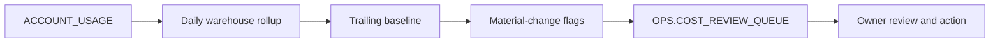

# Snowflake Cost Observability

> Portfolio lab using synthetic object names and example thresholds.

## Purpose

Turn account-usage history into an explainable review queue: which warehouse changed, when it changed, and who should investigate.

## Architecture

## What This Demonstrates

- attribution before optimization;
- a stable daily grain for trend analysis;
- baseline-relative flags instead of unexplained hard limits;
- an operational queue with owner, status, and resolution notes.

## Quick Start

1. Review [sql/01_cost_observability.sql](sql/01_cost_observability.sql).
2. Replace the example database, schema, and role values.
3. Run only in an isolated development environment.
4. Validate the source-view latency and your organization’s billing model.

## Key Decisions

| Decision | Why | Tradeoff |
|---|---|---|
| Aggregate daily | Makes trends and review cadence easy to explain | Not suitable for real-time alerting |
| Compare with a trailing average | Adapts to each warehouse’s normal scale | Seasonal workloads need a richer baseline |
| Create a review queue | Makes ownership and disposition explicit | Requires a real operating process |
| Keep thresholds configurable | Supports different risk tolerances | Poor defaults can create alert fatigue |

## Operations

When a flag appears, confirm source latency, compare workload volume, identify recent releases or schedule changes, assign an owner, and record the disposition. Tune the threshold only after classifying false positives; do not silence unexplained changes.

## Failure Modes

- late usage history creates an incomplete latest day;
- renamed or short-lived warehouses fragment trends;
- workload growth is mistaken for inefficiency;
- cloud-services adjustments are confused with raw consumption;
- alerts exist but no owner closes the loop.

## FAQ

**Does this suspend warehouses?** No. It creates visibility and a review workflow. Enforcement needs separate, carefully tested controls.

**Why not alert on a fixed credit value?** A fixed value can be useful for a budget, but relative change is better for finding unexpected behavior across differently sized warehouses.

**What would production add?** Seasonality-aware baselines, tags and ownership data, notification routing, backfill handling, tests, retention, and dashboards.

## Sanitization Note

No real account, warehouse, cost, owner, alert, or incident details are included.

