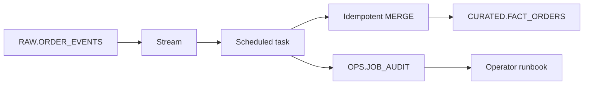

# Snowflake ETL Job Hardening

> Portfolio lab using synthetic order events and generic operational metadata.

## Purpose

Show how an incremental Snowflake load can be made repeatable, observable, and recoverable instead of relying on a scheduled SQL statement alone.

## Architecture

## Reliability Properties

- the `MERGE` is safe to retry for the same business key;
- the stream limits work to changed records;
- each run records start, end, status, and rows affected;
- recovery separates stopping the schedule, diagnosing impact, replaying, and validating.

## Quick Start

1. Read [sql/01_incremental_job.sql](sql/01_incremental_job.sql) completely.
2. Replace generic roles, warehouses, and schedules.
3. Add synthetic test rows in a development database.
4. Run the procedure manually before enabling the task.
5. Test duplicate input, late arrival, malformed data, and retry behavior.

## Key Decisions

| Decision | Why | Tradeoff |
|---|---|---|
| Merge on `order_id` | Makes retries converge on one current row | History needs a separate change model |
| Put orchestration in a procedure | Centralizes status and error handling | Procedure logic needs testing and review |
| Audit every run | Shortens diagnosis and supports SLOs | Adds metadata maintenance |
| Enable the task last | Prevents untested schedules from running | Requires an explicit launch step |

## Runbook

1. Suspend the task if repeated failures could create impact.
2. Capture the failed run ID and error category; never copy sensitive logs into public issues.
3. Check stream state, source freshness, target constraints, and warehouse availability.
4. Correct the cause and run one manual replay.
5. Reconcile source and target counts and inspect duplicates.
6. Resume the task and monitor the next scheduled run.

## Failure Modes

- stream staleness after retention is exceeded;
- task runs without adequate privileges or compute;
- multiple source events for one key produce ambiguous ordering;
- schema drift breaks the merge contract;
- a retry succeeds but the original failed audit record remains unresolved.

## FAQ

**Is a stream a permanent event archive?** No. It is change-tracking state and must be consumed within the relevant retention window.

**Why use an idempotent merge?** Schedulers and networks fail. A safe retry should converge on the intended state instead of duplicating it.

**What would production add?** Deployment automation, contract tests, quarantine handling, alert routing, backfill tooling, SLOs, and tested rollback procedures.

## Sanitization Note

All objects and fields are synthetic. No production schedule, volume, error, SLA, or business rule is represented.

