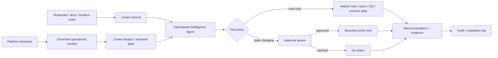

# Operational Intelligence AI System

> Public-safe reference architecture. All object names, incidents, thresholds, and examples are synthetic. This lab demonstrates system design patterns; it does not reproduce an employer implementation.

## Problem

Data platforms already generate the evidence needed to investigate many operational problems: task history, query history, schema changes, data-quality exceptions, cost anomalies, deployment metadata, runbooks, and incident notes. The hard part is turning that evidence into a system that can answer useful questions quickly **without giving an AI model uncontrolled authority over the platform**.

This lab designs an operational-intelligence layer that can:

- answer structured questions about platform health;
- retrieve unstructured runbooks and troubleshooting notes;
- correlate failures across tasks, data quality, schema changes, and usage;
- propose likely root causes and next actions;
- execute only explicitly allowed read-only tools by default;
- require approval before any state-changing action;
- record the evidence, recommendation, tool calls, approvals, and outcome for later review.

The key architectural rule is simple:

> **Reasoning is not authority.** An agent may investigate and recommend broadly; its ability to change the platform should remain narrow, explicit, observable, and revocable.

## Architecture



## Why Split Structured and Unstructured Retrieval

Operational questions usually cross two information shapes:

1. **Structured facts** — task states, timestamps, object metadata, exception counts, credit usage, ownership, deployment versions.
2. **Unstructured context** — runbooks, architectural decisions, known failure modes, escalation notes, remediation procedures.

Cortex Analyst (or an equivalent governed semantic-query layer) is well suited to structured questions where metrics and relationships should be constrained by a semantic model. Cortex Search (or an equivalent retrieval layer) is better suited to documents and operational text. The agent's job is to orchestrate between them rather than force one retrieval method to solve both problems.

## Example Scenario

A synthetic downstream reporting task begins failing shortly after a source table changes.

A user asks:

> Why did the revenue refresh fail this morning, what is affected, and what should we do next?

The agent should not jump directly to a repair action. It should build an evidence chain:

1. Query the incident surface for failed tasks in the requested window.
2. Identify the first failing node rather than only the final downstream failure.
3. Check recent schema changes for the affected source and dependent objects.
4. Check data-quality exceptions and deployment history for corroborating evidence.
5. Retrieve the relevant schema-drift and recovery runbooks.
6. Produce a root-cause hypothesis with evidence and uncertainty.
7. Recommend a bounded next step.
8. If the next step changes platform state, create an approval request rather than executing automatically.

## System Boundaries

| Capability | Default | Why |
|---|---|---|
| Read operational metadata | Allowed | Core investigation capability |
| Query governed analytical views | Allowed | Constrained through semantic definitions and role grants |
| Search runbooks and docs | Allowed | Retrieval does not change platform state |
| Generate incident summary | Allowed | Low-risk synthesis |
| Recommend SQL or remediation | Allowed | Recommendation is not execution |
| Suspend/resume a task | Approval required | Changes platform state |
| Modify grants or roles | Approval required / separate admin workflow | High security impact |
| Change production objects | Approval required | Potentially destructive or consumer-facing |
| Expand its own permissions | Never | An agent should not grant itself authority |

## Reference Data Model

The SQL in [`sql/`](sql/) creates a compact synthetic surface for the agent to inspect:

| File | Purpose |
|---|---|
| [`01_operational_signals.sql`](sql/01_operational_signals.sql) | Synthetic task, schema-change, and data-quality signal tables |
| [`02_incident_surface.sql`](sql/02_incident_surface.sql) | A review-friendly incident view that correlates failures with nearby changes |
| [`03_agent_audit.sql`](sql/03_agent_audit.sql) | Audit and approval tables for recommendations and bounded actions |

The point is not to reproduce every Snowflake account-usage view. It is to show the **contract presented to the AI system**: a small, governed operational surface with clear ownership and semantics.

## Agent Contract

The agent receives four classes of capability:

### 1. Structured analysis

Use governed semantic definitions to answer questions such as:

- Which production workflows failed in the last four hours?
- What was the first failing task in the dependency chain?
- Which incidents coincide with a schema change?
- Which data products are currently outside quality thresholds?
- Is this failure isolated or recurring?

### 2. Document retrieval

Search operational documents for:

- recovery procedures;
- known failure signatures;
- ownership and escalation rules;
- architectural decisions;
- deployment and rollback guidance.

### 3. Read-only tools

Tools should expose narrow functions such as:

```text
get_task_failures(window, domain)
get_recent_schema_changes(object_name, window)
get_quality_exceptions(data_product, window)
get_dependency_context(task_name)
get_runbook(topic)
```

They should return structured evidence, not grant the model arbitrary SQL execution under an administrative role.

### 4. Approval-gated actions

A state-changing tool should require an explicit approval object:

```text
prepare_action(action_type, target, reason, evidence_ids)
        ↓
approval queue
        ↓
human approval
        ↓
execute_bounded_action(approval_id)
```

An approval is tied to one action, one target, one expiration window, and the evidence that justified it. Approval to resume `TASK_A` should not become generic permission to operate on every task.

## Evidence-First Response Shape

For operational use, the response should make it easy to distinguish observation from inference:

```text
Status
- Revenue refresh is incomplete.

Observed evidence
- TASK_LOAD_REVENUE failed at 06:14 UTC.
- Source object SRC_REVENUE changed shape at 05:52 UTC.
- The first failing transform references a field added in that change window.
- Three downstream tasks were skipped after the upstream failure.

Likely cause
- Schema drift is the leading explanation.

Confidence
- High, because failure timing and dependency evidence align.

Recommended next step
- Validate the transform contract against the new source schema.

Action
- No platform changes executed.
```

This is preferable to a confident paragraph that mixes facts, assumptions, and actions together.

## Evaluation

An agent that sounds useful is not necessarily reliable. The lab uses an evaluation plan rather than a single demo prompt. See [`evaluation.md`](evaluation.md).

Key dimensions:

- retrieval correctness;
- root-cause ranking;
- evidence citation / traceability;
- tool selection;
- refusal to perform unauthorized actions;
- approval behavior;
- false-positive rate;
- time-to-useful-diagnosis.

## Failure Modes

- **Plausible but unsupported RCA:** the agent produces a familiar explanation without enough evidence.
- **Wrong first failure:** downstream errors mask the actual upstream cause.
- **Stale runbook retrieval:** search returns instructions that no longer match the platform.
- **Semantic ambiguity:** two teams use the same metric name differently.
- **Tool overreach:** a generic SQL or admin tool bypasses the intended permission boundary.
- **Approval laundering:** a broad approval is reused for a materially different action.
- **Partial evidence:** delayed account-usage telemetry creates an incomplete incident picture.
- **Automation bias:** operators accept a polished recommendation without reviewing the evidence.

## Runbook

1. Confirm the incident time window and affected business/data domain.
2. Review the agent's observed evidence separately from its inferred cause.
3. Confirm the first failing node and dependency impact.
4. Check whether metadata sources have known latency before declaring evidence complete.
5. Review retrieved runbook version and ownership.
6. If a state-changing action is proposed, verify the exact target, reason, and expiration in the approval record.
7. Execute through the bounded tool only after approval.
8. Record the outcome and whether the recommendation was correct.
9. Feed incorrect or weak diagnoses into the evaluation set.

## What I Would Add for Production

- versioned semantic models and retrieval corpora;
- freshness SLAs for every evidence source;
- a policy engine independent of the LLM;
- stronger identity propagation from user to tool execution;
- per-tool rate limits and blast-radius controls;
- automated regression evaluation before prompt/model changes;
- drift monitoring for retrieval quality and incident classification;
- explicit break-glass procedures that do not depend on the agent;
- dashboards for approval volume, false positives, tool failures, and operator override rate.

## Design Notes

See [`architecture.md`](architecture.md) for the trust-boundary and control-plane decisions behind this lab.

## Safety and Scope

All names, objects, incidents, and thresholds in this lab are synthetic. The architecture is intentionally generic and does not reproduce private employer code, account identifiers, object names, volumes, incidents, or screenshots.
