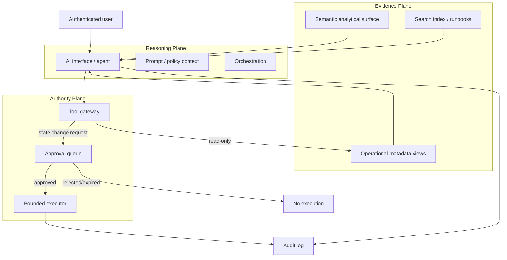

# Architecture Notes — Operational Intelligence AI System

## Design Goal

The system should reduce the time between **signal → diagnosis → safe next action** without turning an LLM into a privileged platform administrator.

That leads to three architectural separations:

1. **Evidence plane** — governed facts and documents the system may inspect.
2. **Reasoning plane** — models that synthesize, rank hypotheses, and choose tools.
3. **Authority plane** — deterministic controls that decide what may actually execute.

The reasoning plane can be probabilistic. The authority plane should not be.

## Trust Boundaries



## Evidence Plane

The AI layer should not need direct access to every underlying system table. Instead, expose a curated operational model with stable semantics.

Examples:

- task and workflow state;
- first-failure and dependency context;
- data-quality exceptions;
- recent schema changes;
- deployment metadata;
- cost / usage anomalies;
- owner and escalation metadata.

Benefits:

- simpler semantic model;
- narrower permissions;
- easier testing;
- fewer ambiguous joins;
- stable contracts even if underlying metadata sources change.

## Reasoning Plane

The agent is responsible for:

- decomposing the question;
- selecting structured analysis vs document search;
- requesting evidence through approved tools;
- ranking root-cause hypotheses;
- identifying missing evidence;
- producing recommendations;
- preparing, but not self-authorizing, sensitive actions.

The agent should explicitly distinguish:

- **observed fact**;
- **inference**;
- **recommendation**;
- **executed action**.

## Authority Plane

Tool execution should be controlled outside the model prompt.

A robust tool gateway should evaluate at least:

| Control | Example |
|---|---|
| Caller identity | Is this user allowed to request this operation? |
| Tool allow-list | Is the requested action exposed at all? |
| Target scope | Is this exact object in the permitted domain? |
| Change class | Read-only, reversible, privileged, destructive? |
| Approval requirement | Does this action need a human? |
| Approval binding | Does the approval match action + target + parameters? |
| Expiration | Is the approval still valid? |
| Rate / blast-radius limit | Could one request affect too many objects? |
| Audit requirement | Can the decision be reconstructed later? |

The model should never be able to relax these controls by changing its prompt or choosing a different tool argument.

## Least-Privilege Pattern

A practical role split could look like:

```text
AI_OBSERVER_ROLE
  - SELECT on curated operational views
  - USAGE on approved semantic/search services
  - no ownership, no grant management, no production DDL

AI_ACTION_REQUESTER_ROLE
  - INSERT into approval request table / call request procedure
  - cannot execute the final state-changing operation

AI_BOUNDED_EXECUTOR_ROLE
  - used only by deterministic executor
  - narrow privileges for explicitly supported actions
  - not available directly to the LLM session
```

The exact Snowflake role design depends on the organization; the important property is separation between **requesting** and **executing** a privileged action.

## Human Approval Contract

An approval should be specific enough that its meaning is unambiguous.

Recommended fields:

```text
approval_id
requested_by
requested_at
action_type
target_type
target_name
parameter_hash
reason
evidence_ids
risk_class
status
approved_by
approved_at
expires_at
executed_at
execution_result
```

A valid executor checks the approved record rather than trusting an `approved=true` argument supplied by the agent.

## Retrieval Design

Operational search corpora should carry metadata such as:

- document owner;
- effective date;
- last reviewed date;
- system/domain;
- environment;
- runbook version;
- superseded flag.

Retrieval ranking can then favor current, environment-matched guidance rather than only semantically similar text.

## Semantic Model Design

A semantic operational layer should define business-safe meanings for terms such as:

- failed run;
- first failure;
- impacted downstream object;
- open quality exception;
- recurring incident;
- recent schema change;
- material cost anomaly.

Without these definitions, natural-language querying can produce technically valid SQL that answers the wrong operational question.

## Observability for the AI Layer

The AI system itself becomes another production system and needs telemetry.

Track:

- user question;
- model / configuration version;
- retrieved evidence IDs;
- semantic queries issued;
- tools selected;
- tool latency and failure;
- recommendation;
- confidence / uncertainty fields;
- approval request and outcome;
- human override;
- final incident outcome;
- evaluator result.

This supports both incident review and model/prompt regression analysis.

## State-Changing Action Classes

Not all actions need the same policy.

| Class | Example | Suggested control |
|---|---|---|
| Read | Inspect failures | Automatic |
| Draft | Generate remediation SQL | Automatic, never execute |
| Reversible / low blast radius | Resume one approved task | Human approval + bounded executor |
| Privileged | Modify role grants | Separate admin workflow |
| Destructive | Drop/replace production object | Exclude from agent tools by default |

## Degraded Modes

A production design should continue to be useful when one AI component is unavailable.

Examples:

- Search unavailable → structured incident view still works.
- Analyst unavailable → deterministic operational dashboards remain available.
- Agent unavailable → runbooks and approval workflow still function manually.
- Model confidence low → return evidence and request operator review rather than inventing a diagnosis.

The AI layer should improve operations, not become a single point of failure for operating the platform.
